# smart-lead-test

### Here is the Architecture diagram for this test

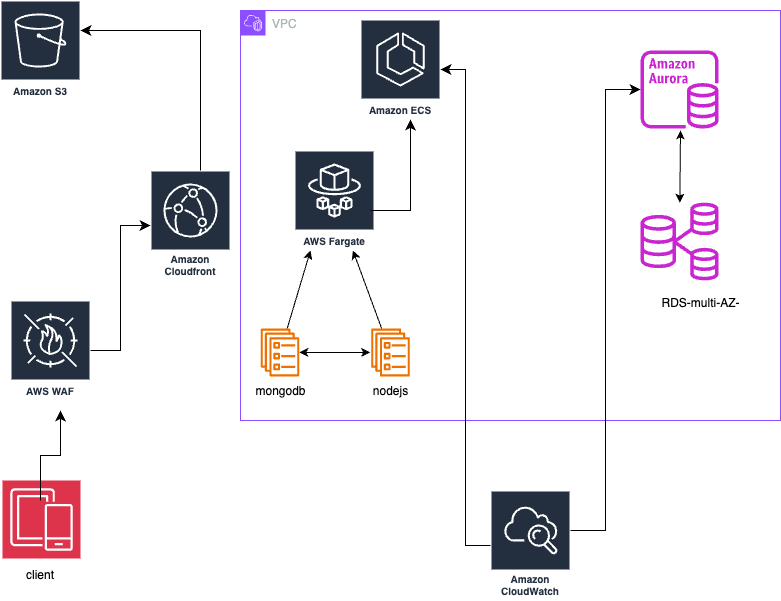

**Step-1:**

Firstly i cloned your nodejs repo and created my custom Dockerfile which is a multi-stage dockerfile.

Then i build the image and push into ecr repo. by using this command:-

```
docker build -t 782408168927.dkr.ecr.ap-south-1.amazonaws.com/nodejs-apps:latest .

docker push 782408168927.dkr.ecr.ap-south-1.amazonaws.com/nodejs-apps:latest

```


**Step-2:**

Then i created s3 bucket for storing our tf-state files over there.


**Step-3:**

After that i created terraform scripts for RDS, ECS-ECR, WAF, S3, and Cloudfront. you can got to each folder and apply these commands:-

**IMPORTANT-NOTE**

Here i used AWS secret manager to store my reds creds for security purpose becuase i dont want to expose the database password and all that directly into terraform RDS code, so you can check that intresting part. 

```
terraform init
```

```
terraform plan  -out plan.out
```

```
terraform apply plan.out 

```


**Step-4:**  OUTPUTS:-

Here you can see all resources outputs as below:-

**ECR**

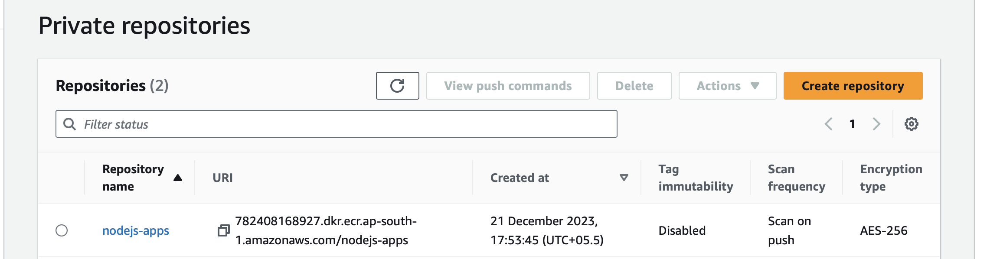

**ECS**
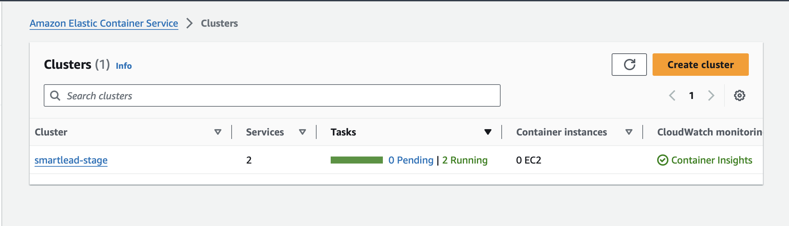

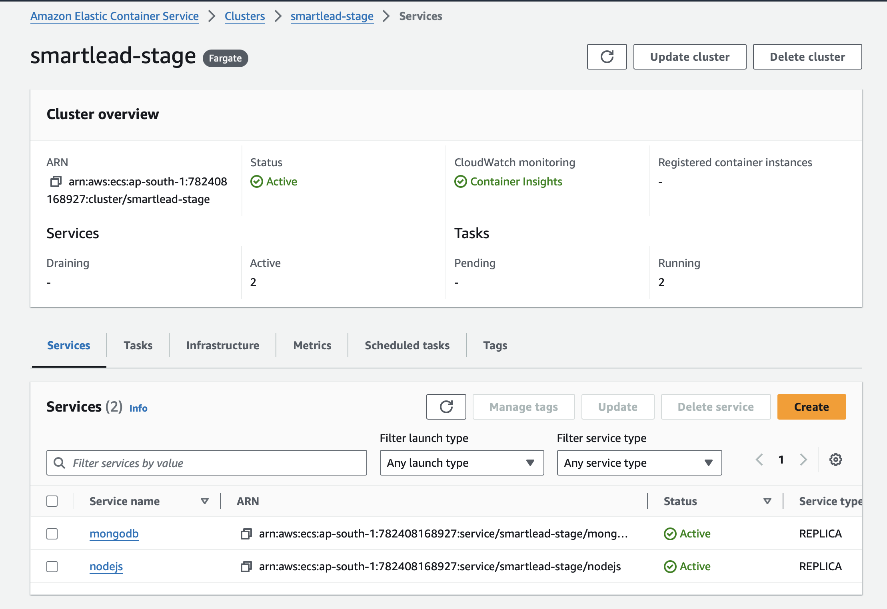

**nodejs**

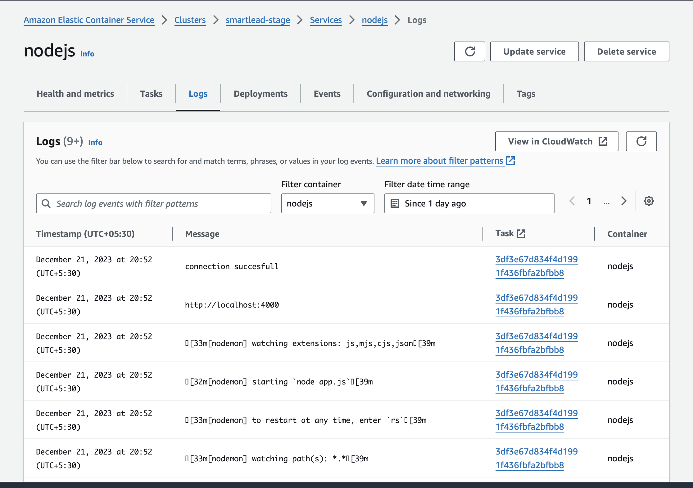


**s3 and cloudfront**

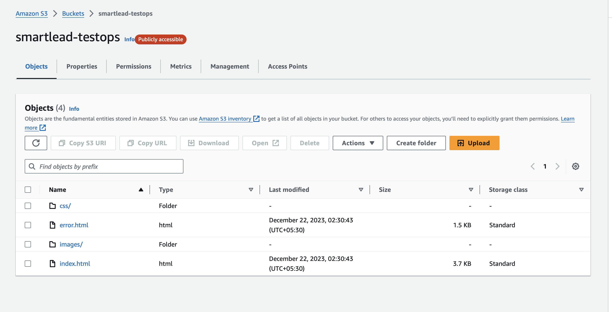


**cloudwatch dashboard & Alrams**

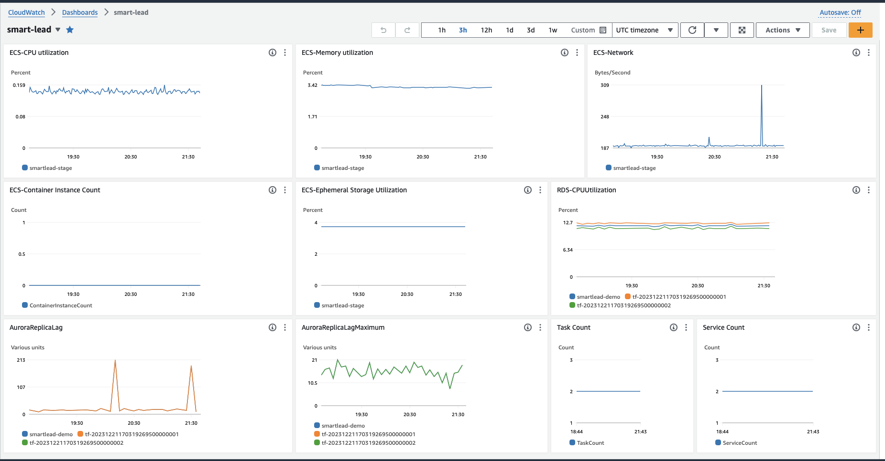

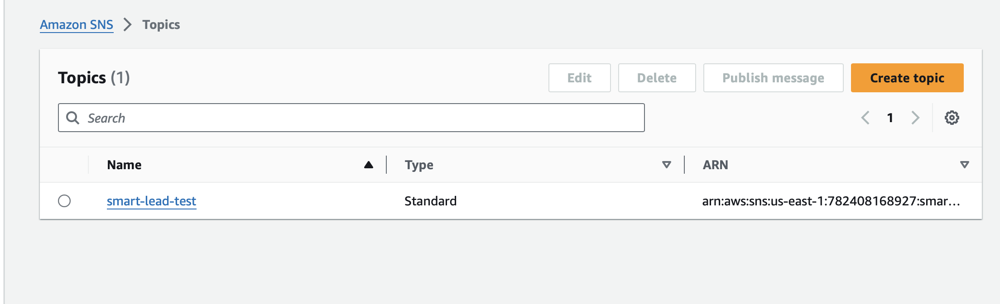

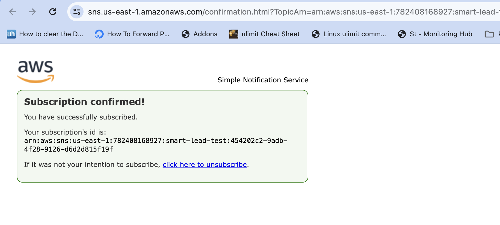

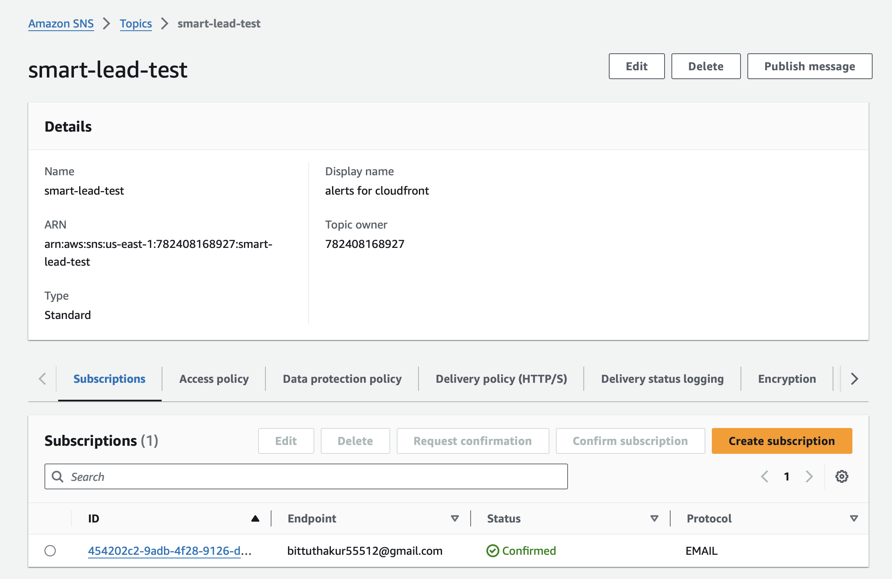

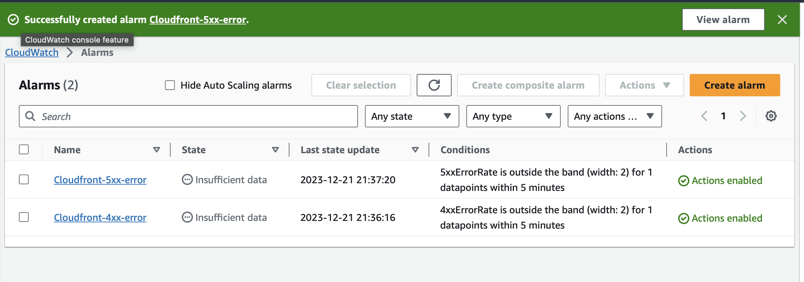

**budget-saving-plan**

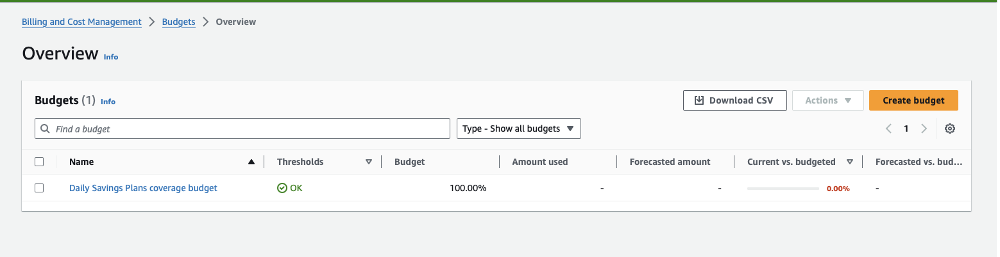

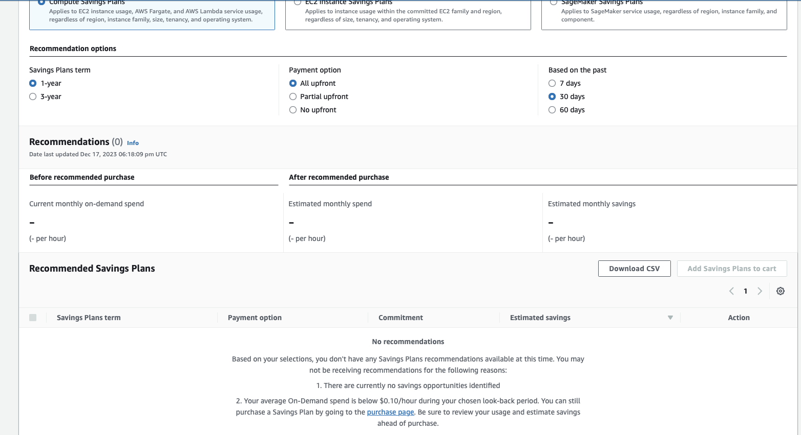


**Step-5:** To destroy use this comman:-

```
terraform destroy
```

